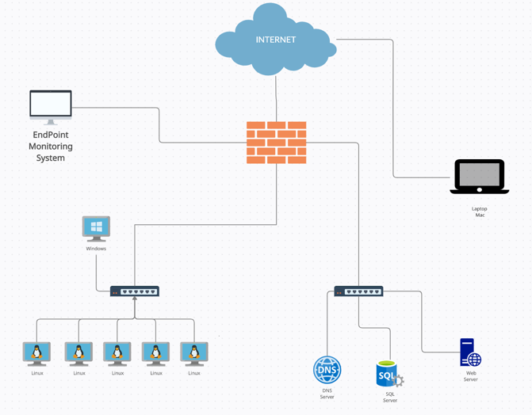

# Scenario "revisor". Multi-antivirus file Checker

In this scenario you will need to deploy a web service that checks files for viruses and malware. In order to verify if the file contains viruses or is clean, the system should use, at least, 3 antivirus engines. Your service should receive a file through a web front end and then send it to each of the antivirus engines, collecte the answers from all of them and present a final report. 

This scenario architecture is intended to be deployed in the cloud using [kubernetes](https://kubernetes.io). This will ensure that the service is available ubiquitously and also that highly available.    

# Scenario "Homas": Hospital application security
This scenario is focused on a hospital information system, and it needs to fulfil the general requirements that this kind of systems have. The following paper describes the requirements for Hospital Information Systems (HIS) architecture [link](https://www.scitepress.org/Papers/2012/38850/38850.pdf).

For this project you  need to implement one application which takes  part of a hospital information system. This is teh case of an Implantable Medical Device (IMD) to track patients' insulin levels.

 > When monitoring  a patient’s correct insulin intake. One workflow consists of reading blood glucose levels and dietary intake at determined intervals. Another workflow will determine recommended bolus dose (fast acting) insulin from these readings and feed it back to the patient. A third workflow will read the actual insulin intake whereas a fourth workflow will compare the two and fuse the information to various stakeholders. Applications are developed and stored in the form of conceptual domain models (ontologies). [^1]

[^1]: https://www.reaction-project.eu/articles.php?article_id=3

You can use  well-known technologies and tools to implement that application in a virtual environment, but prioritize the use of containers so it can be easily deployed in almost any system.

- [A Data Encryption Solution for Mobile Health Apps in Cooperation Environments](https://www.ncbi.nlm.nih.gov/pmc/articles/PMC3636327/)

1. SIEM (SPLUNK, ...)
2. AUDIT & LOGS (OSQUERY, ...)
3. COMPLIANCE (SCAP, LYNIS, ...)
4. HIDS (OSSEC)
5. MALWARE Detection (YARA, ...)
6. Public Key Infrastructure (PKI)
7. You can propose one different technology/tool but it needs to be approved by the instructor

Once your application is deployed you need to provide the proper security countermeasures so the HIS security requirements are satisfied. Use at least any 4 of the following protection tools/technologies

# Scenario "BanKo". Performance analysis of Botan cryptographic library in a PostQuatnum World. 

[Open Quantum Safe](https://github.com/open-quantum-safe) is a modern cryptographic library in C with an included python binding, which allows to use it from python programs.`OQS` is C library for prototyping and experimenting with quantum-resistant cryptography.

Among other advantages, Botan includes *Post-Quantum* cryptographic algorithms:
+ Digital signature scheme *XMSS*
+ Key  agreement schemes *McEliece* and *NewHope*

For organizations like the one in our scenario, change their systems towards safe postquantum cryptographic algorithms has numerous implications (storage, performance, management, ...). You can read the following NIST publication to ilustrate these challenges: 
[Exploring Challenges Associated with Adopting and
Using Post-Quantum Cryptographic Algorithms](https://nvlpubs.nist.gov/nistpubs/CSWP/NIST.CSWP.04282021.pdf). 

The work in this project is to perform a complete performance analysis of this cryptographic library that shows the performance implications of the use of postquantum cryptographic algorithms for:
+ Symmetric Encryption
+ Key agreement schemes
+ Digital signature schemes
+ *Random generation, or other cryptographic mechanism can be added*

You can use well-know performance methodologies to compare currently secure algorithm and schemes versus the future algorithms to be used in the postquantum era. The following publication will provide you a guide of what performance benchmark can be used: 
[Performance analisys Paper](https://arxiv.org/pdf/2010.06139.pdf)

Finally, and only for the postquantum algoritms use you need to perform and statistical and entropy analysis of outputs based on [DieHard](https://web.archive.org/web/20160125103112/http://stat.fsu.edu/pub/diehard/) or the [NIST Randomness test](https://nvlpubs.nist.gov/nistpubs/legacy/sp/nistspecialpublication800-22r1a.pdf).

# Scenario Oceano: Security information monitoring for a fleet of heterogeneous machines and containers.

In this project, you need to build, deploy and test robust, scalable and customizable Endpoint Monitoring System for a sotfware Corporation. This system can be used to monitor the consistency, security and compliance posture of all the endpoints throughout the organization.

First part of your work will be to simulate the endpoint systems (10) of our software corporation. You can use virtual machines for systems like windows or mac, but it is recommended that you  use lightweight containers whenever you have a chance. The following diagram presents a simplification of the company's network architecture.

Remember that although your systems no need to store any information, they need to be functional and reachable by the network (use the address scheme that you consider appropiate). 

Once you have the system deployed you need to install:
+ OSQuery, which turns live Endpoints into a query-able database that is capable of rendering all the necessary information to audit the endpoints to analyze their consistency and vulnerabilities.
+ [Fleet device manager](https://fleetdm.com/) an open source osquery manager that allows to monitor numerous osqueried systems.
+ [ElasticSearch and Kibana](https://blog.fleetdm.com/build-an-osquery-performance-dashboard-1b1762ee3880) to create a performance osquery dashboard.

Once the whole system is deployed you should exemplify two cybersecurity incidents that can be identified through your endpoint monitoring system.  
