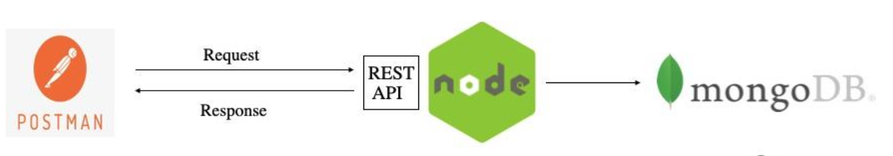

## Defensive tools/technologies to use

1. SIEM (SPLUNK, ...)
1. AUDIT & LOGS (OSQUERY, ...)
1. COMPLIANCE (SCAP, LYNIS, ...)
1. HIDS (OSSEC)
1. MALWARE Detection (YARA, ...)
1. Public Key Infrastructure (PKI)

# Scenario Honey. Automatic Deployment of HoneyPots
#### (it does not need to deploy additional security tools.) 

In this scenario you will need to deploy a honeynet architecture into a cloud provider. Deployment need to be automatized (recommend to use [Terraform](https://www.terraform.io/) although [Cloud Formation](https://docs.aws.amazon.com/AWSCloudFormation/latest/UserGuide/Welcome.html) is also acceptable), so the result of the project is the code needed to deploy the honeynet architecture, and also the code to seamlessly delete/remove all architecture elements.
The honeynet will be based on both, low and high interactions honeypots.  

**<u>High Interaction Honeypots</u>**   
For the high interaction honeypots, actual systems and applications can be deployed because they will provide full interaction with clients (without any sensitive information if any).  This is the case of:
- Content Management System (CMS) such as Joomla or WordPress.
- Database system such as Mysql or SQL server.
- FTP server such as Filezilla or vsftpd.

**<u>Low Interaction Honeypots</u>**   
In this case, low interaction honeypots will not provide full interaction but an emulation of the actual service. For that reason, this honeypots can be identified by attackers. This is the case of:
- [T-pot](https://github.security.telekom.com/2020/08/honeypot-tpot-20.06-released.html)
- [Containerized Deception](https://appfleet.com/blog/compromised-container-detection-with-honeypot-containers/)

Besides, the deployment of the honeynet, it is needed to forward all logs generated into a centralized log collector. To implement this log forwarding different solutions can be used:
- rsyslog
- Log aggregation (i.e.: Firebeat - ElasticSearch)

It is important that aggregated logs can be explored using a GUI tool (i.e.: syslog-ng, Kibana, SPLUNK, )

# Scenario Homas: Hospital application security
This scenario is focused on a hospital information system, and the general requirements that this kind of systems have. The following paper describes the requirements for Hospital Information Systems (HIS) architecture [link](https://www.scitepress.org/Papers/2012/38850/38850.pdf).

For this project you just need to implement one application which takes  part of this architecture.

 > An example of this could be monitoring of a patient’s correct insulin intake. One workflow consists of reading blood glucose levels and dietary intake at determined intervals. Another workflow will determine recommended bolus dose (fast acting) insulin from these readings and feed it back to the patient. A third workflow will read the actual insulin intake whereas a fourth workflow will compare the two and fuse the information to various stakeholders. Applications are developed and stored in the form of conceptual domain models (ontologies). [^1]

[^1]: https://www.reaction-project.eu/articles.php?article_id=3

You can use simple well-known technologies and tools to implement that application in a virtual environment (remember to prioritize the use of containers)

## Cloud. 
- Deploy a two-factor authentication with google authenticator
- Setting up OAuth in Github
- Splunk collector

## Scenario BanKo. Performance analysis of Botan cryptographic library in a PostQuatnum configuration.

- [A Data Encryption Solution for Mobile Health Apps in Cooperation Environments](https://www.ncbi.nlm.nih.gov/pmc/articles/PMC3636327/)

# Scenario 1. Audit logs collector

Deploy a Honey Net based on different systems, mostly IoT. 
- Docker containers
- Low and high interaction systems.

Red tea